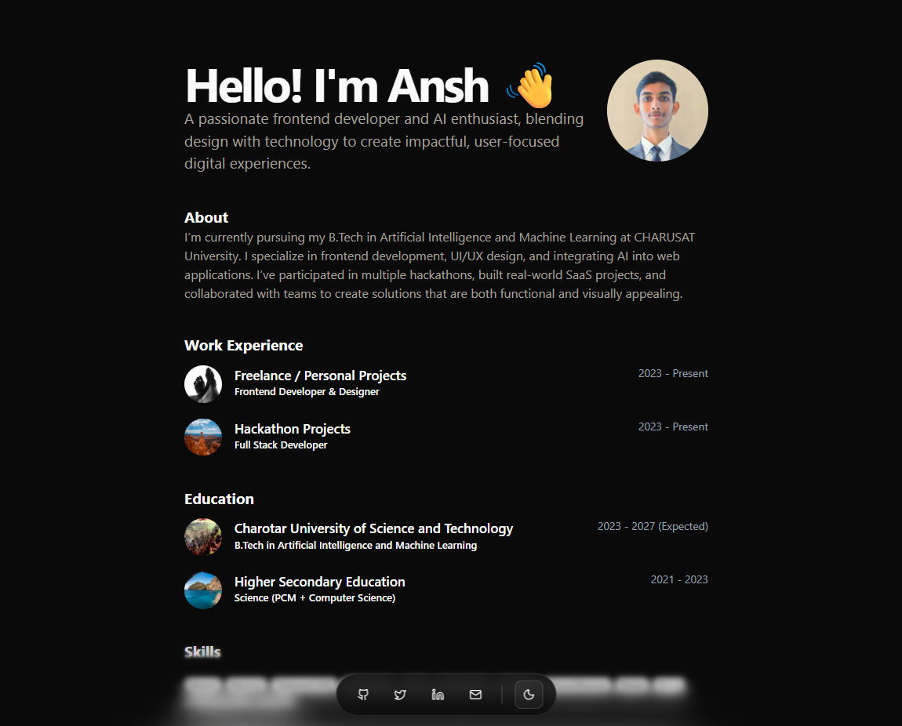
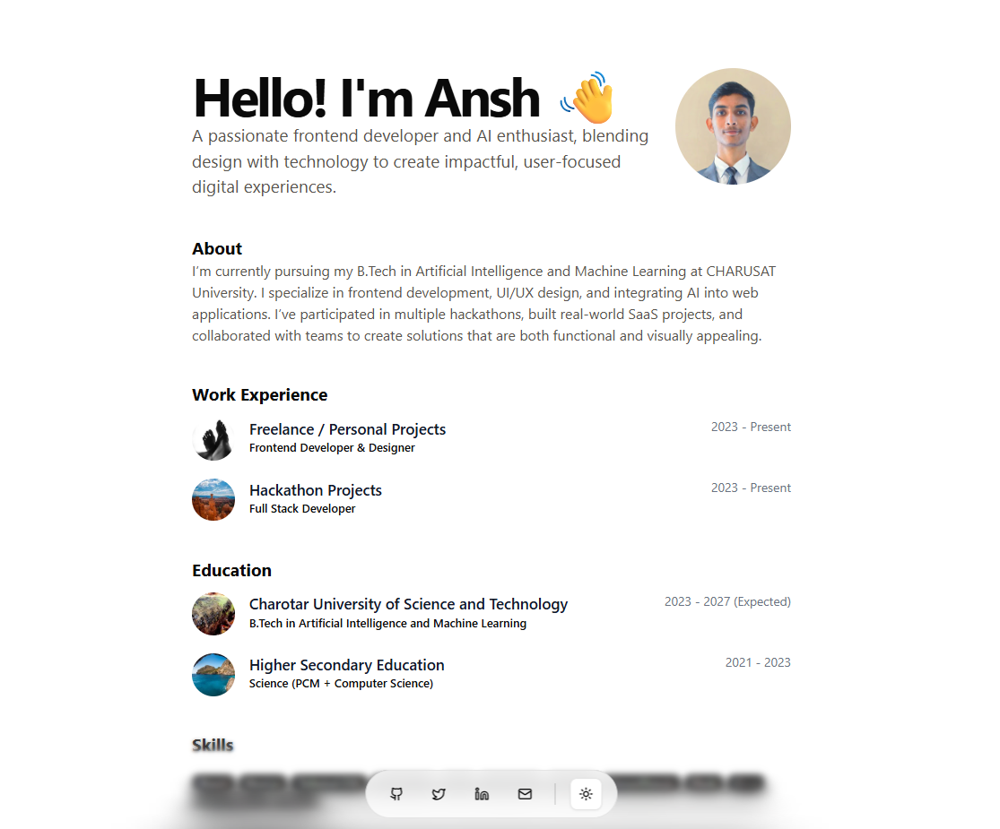
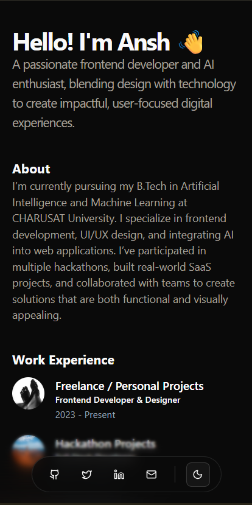

# 🚀 Portfolio Website

A modern, responsive portfolio website built with React, featuring smooth animations, dark/light theme support, and interactive UI components.
I maked it using Shadcn UI.

## 📸 Screenshots

<div align="center">

### 🌙 Dark Mode


### ☀️ Light Mode


### 📱 Mobile View


</div>

## ✨ Features

- **🎨 Modern UI/UX Design** - Built with Shadcn/UI components for consistent styling
- **🌙 Theme Toggle** - Dark and light mode support with system preference detection
- **📱 Responsive Design** - Optimized for mobile, tablet, and desktop devices
- **🎭 Smooth Animations** - Framer Motion integration for scroll-triggered animations
- **💀 Loading States** - Skeleton components for improved perceived performance
- **📧 Contact Form** - Functional contact form with Web3Forms integration
- **🎯 Interactive Elements** - Hover tooltips, expandable cards, and smooth transitions
- **🌊 Smooth Scrolling** - Lenis scroll library for enhanced user experience

## 🛠️ Tech Stack

- **⚛️ Frontend**: React, Vite, Tailwind CSS
- **🎨 UI Library**: Shadcn/UI
- **🎬 Animations**: Framer Motion
- **🎯 Icons**: Lucide React
- **🌊 Smooth Scrolling**: Lenis
- **📝 Forms**: Web3Forms
- **💅 Styling**: Tailwind CSS

## 🚀 Getting Started

```bash
# Clone the repository
git clone <repository-url>

# Navigate to project directory
cd portfolio

# Install dependencies
npm install

# Start development server
npm run dev
```

## 📁 Project Structure

```
src/
├── components/ui/          # Reusable UI components
│   ├── badge.jsx          # Badge component
│   ├── button.jsx         # Button variants
│   ├── skeleton.jsx       # Loading skeleton
│   ├── ProjectCard.jsx    # Project showcase cards
│   ├── History.jsx        # Timeline component
│   ├── ExperienceUI.jsx   # Experience cards
│   └── ThemeProvider.jsx  # Theme context provider
├── App.jsx                # Main application component
├── App.css               # Custom styles
└── main.jsx              # Application entry point
```

## 🔧 Key Components

### 📄 App.jsx
Main application component containing:
- State management for loading, alerts, and form handling
- Contact form submission logic with Web3Forms
- Smooth scroll initialization with Lenis
- Responsive layout with mobile-first approach
- Scroll-triggered animations using Framer Motion

### 🧭 Navigation
- Fixed bottom navigation bar with social media links
- Hover tooltips displaying platform names
- Theme toggle with proper context integration
- Backdrop blur effects for visual depth

### 📋 Sections
- **Hero**: Introduction with profile image and animations
- **About**: Personal description with typography focus
- **Experience**: Expandable cards with company information
- **Education**: Timeline format with institutional details
- **Skills**: Interactive technology badges
- **Projects**: Video previews with live demo and GitHub links
- **History**: Achievement and hackathon timeline
- **Contact**: Modal form with validation and feedback

## 🎭 Animation System

- **Scroll Animations**: Blur-to-normal and slide-up effects on scroll
- **Loading States**: Skeleton placeholders matching component dimensions
- **Hover Effects**: Tooltip badges and interactive button states
- **Micro-interactions**: Bouncing chevron and smooth transitions

## 🌙 Theme System

- **Default Theme**: Dark mode with system preference detection
- **Theme Persistence**: Local storage integration
- **Accessibility**: Proper contrast ratios and color schemes
- **Smooth Transitions**: Seamless theme switching

## 📧 Contact Form

- **Web3Forms Integration**: Server-side form processing
- **Validation**: Client-side form validation
- **Feedback System**: Success and error alert notifications
- **Modal Interface**: Non-intrusive dialog implementation

## ⚡ Performance Optimizations

- **Code Splitting**: Dynamic imports for better bundle size
- **Skeleton Loading**: Improved perceived performance
- **Image Optimization**: Lorem Picsum for consistent placeholder images
- **Minimal Dependencies**: Only essential packages included

## ⚙️ Configuration

### 🔐 Environment Variables
Create a `.env` file in the root directory:
```
VITE_WEB3FORMS_ACCESS_KEY=your_access_key_here
```

### 🎨 Customization
1. **Personal Information**: Update data arrays in App.jsx
2. **Social Links**: Modify navigation href attributes
3. **Styling**: Customize Tailwind CSS classes
4. **Animations**: Adjust Framer Motion configurations
5. **Content**: Replace placeholder content with your information

## 📱 Responsive Breakpoints

- **Mobile**: < 640px
- **Tablet**: 640px - 1024px
- **Desktop**: > 1024px

## 🌐 Browser Support

- Chrome (latest)
- Firefox (latest)
- Safari (latest)
- Edge (latest)

## 🤝 Contributing

1. Fork the repository
2. Create a feature branch
3. Make your changes
4. Submit a pull request

## 📄 License

MIT License - see LICENSE file for details
